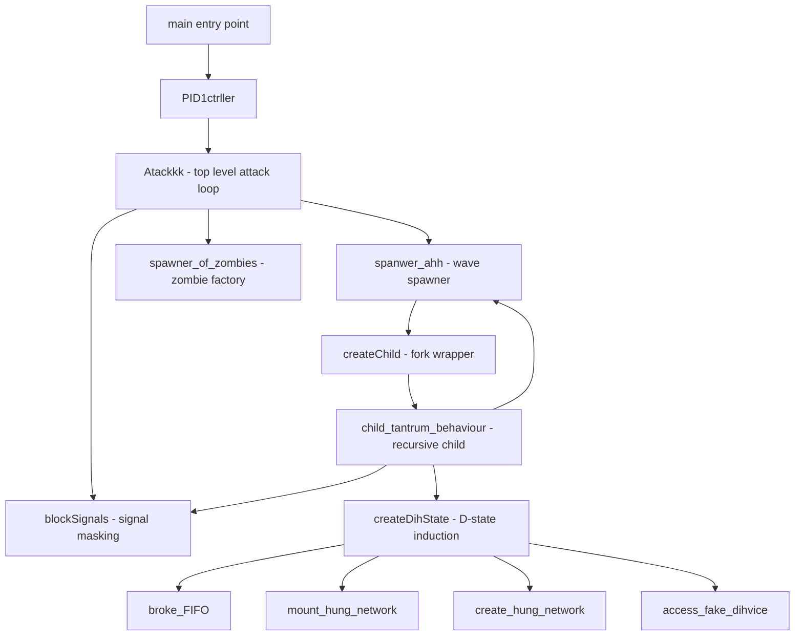
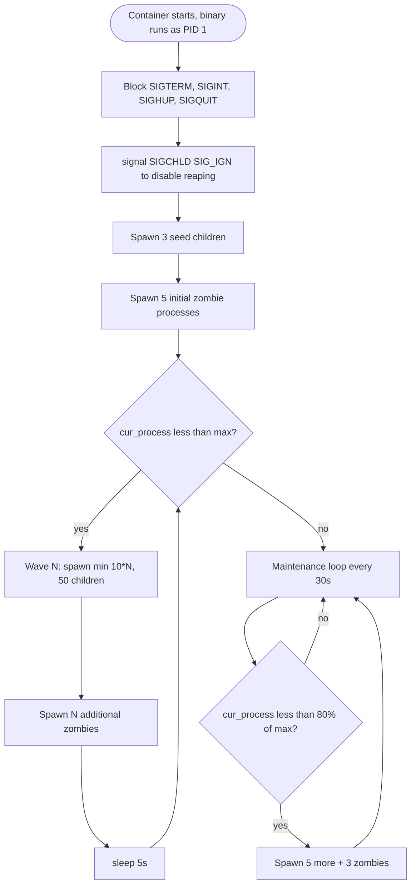
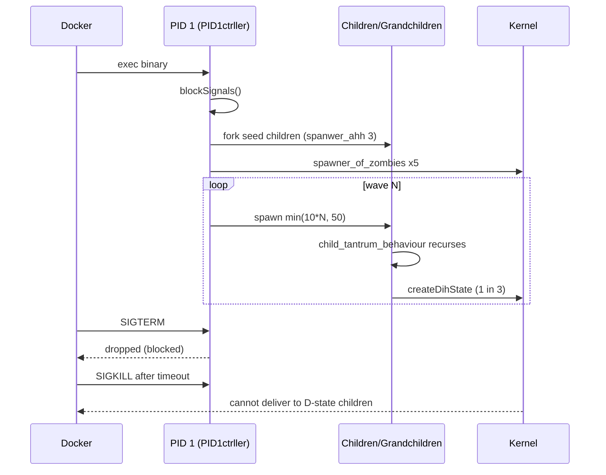
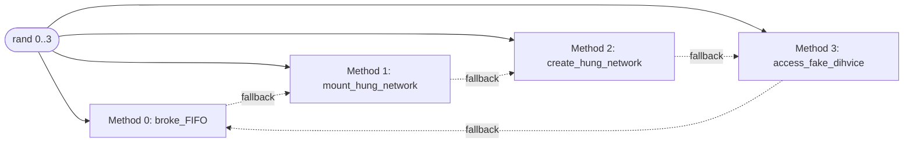

# Yggdrasil

An experimental research project that explores Docker's containerization model by attempting to break it from the inside. The name is borrowed from Norse mythology's World Tree: a deeply entangled root system that, once planted inside a container, makes the container effectively impossible to stop or remove through the standard lifecycle.

> The primary motivation is to learn Docker internals by attempting to break them.

The current focus is `Deadlock/`, a PID 1 controller written in C++ that combines signal masking, exponential process spawning, zombie process creation, and uninterruptible-sleep (D-state) induction to resist `docker stop`, `docker kill`, and even `SIGKILL` in some paths.

---

## Table of Contents

- [Project Objectives](#project-objectives)
- [System Architecture](#system-architecture)
- [Attack Lifecycle](#attack-lifecycle)
- [Anti-Containerization Techniques](#anti-containerization-techniques)
- [The PID1ctrller Class](#the-pid1ctrller-class)
- [D-State Induction Methods](#d-state-induction-methods)
- [Code Organization](#code-organization)
- [Implementation Comparison](#implementation-comparison)
- [Build and Run](#build-and-run)
- [Glossary](#glossary)
- [Disclaimer](#disclaimer)
- [Reference](#reference)

---

## Project Objectives

Yggdrasil injects a "root system" into source code that intertwines so deeply with the host OS that the container becomes resistant to standard termination. The investigation centers on three Linux subsystems that Docker depends on:

1. The default signal-handling semantics of **PID 1** inside a container.
2. The **process table** as a finite, exhaustible resource.
3. The **kernel wait queues** that back uninterruptible sleep (`D` state).

By coordinating attacks across these three surfaces, the container's init process becomes both un-signalable and surrounded by un-reapable children, while a fraction of those children are parked inside the kernel where no userspace signal can reach them.

---

## System Architecture

The diagram below mirrors deepwiki's "Mapping Concepts to Code Entities" view. The `PID1ctrller` class is the central orchestrator; everything else hangs off it.



---

## Attack Lifecycle

This is the wave-based saturation flow driven by `Atackkk()` in `Deadlock/D_State.cpp`. It mirrors deepwiki's "Attack Lifecycle Flow" diagram.



Each child, once forked, runs `child_tantrum_behaviour()` which re-applies the signal mask, builds its own `PID1ctrller`, spawns 2 grandchildren, has a 1-in-3 chance of entering a D-state itself, and then `pause()`s forever waiting on a signal that has been blocked.

---

## Anti-Containerization Techniques

### 1. PID 1 Hijacking

A process running as PID 1 inside a Linux container does **not** receive the kernel's default signal handlers. Unless the program explicitly installs handlers for `SIGTERM`, those signals are silently dropped. Yggdrasil goes further and adds them to the `sigprocmask` block set, so even an explicit handler would not fire.

```cpp
sigaddset(&sig_set, SIGTERM);
sigaddset(&sig_set, SIGINT);
sigaddset(&sig_set, SIGHUP);
sigaddset(&sig_set, SIGQUIT);
sigprocmask(SIG_BLOCK, &sig_set, nullptr);
signal(SIGCHLD, SIG_IGN);   // refuse to reap children
```

`docker stop` first sends `SIGTERM`. With the mask in place, it has no effect, and the 10-second grace period elapses with the container still alive.

### 2. Process Table Saturation

After `SIGCHLD` is ignored, exited children become un-reapable zombies. `spawner_of_zombies()` mass-forks short-lived children whose entries linger in the process table indefinitely. Combined with the exponential `spanwer_ahh()` waves, the host's PID space and the container's process table both fill up, throttling Docker's ability to issue new helper processes.

### 3. Uninterruptible Sleep (D-State)

A process blocked in the kernel on certain operations enters the `D` state. In `D` state the process is invisible to userspace signals: `SIGKILL` is queued but not delivered until the kernel call returns, and several of Yggdrasil's techniques pick calls that will not return for a very long time. See [D-State Induction Methods](#d-state-induction-methods).

---

## The PID1ctrller Class

Defined in `Deadlock/D_State.cpp:36`. Tracks the current process count against a configurable maximum and coordinates the attack stages.

| Member | Role |
|--------|------|
| `max` | Hard ceiling on spawned processes (default 1000) |
| `cur_process` | Live counter incremented in `createChild` and `spawner_of_zombies` |
| `pls_pls_pls_stop` | Soft kill switch, never set true in the current code path |
| `blockSignals()` | Installs the SIGTERM/SIGINT/SIGHUP/SIGQUIT mask and ignores SIGCHLD |
| `createChild()` | `fork()` wrapper; parent increments counter, child runs `spawner_of_zombies` and `child_tantrum_behaviour` |
| `spawner_of_zombies()` | Forks a child that immediately calls `createDihState` and never exits cleanly |
| `spanwer_ahh(count)` | Linear spawner; every third iteration also spawns a zombie |
| `child_tantrum_behaviour()` | Recursive entry point for each child; builds its own controller, spawns 2 grandchildren, optionally enters D-state, then `pause()` forever |
| `createDihState()` | Randomly dispatches one of the four D-state methods, with fallback |
| `Atackkk()` | Top-level loop: block, seed, wave-spawn, maintain |

### PID 1 Control Flow



---

## D-State Induction Methods

`createDihState()` picks one of four techniques at random per child. Each one ends with the child stuck in a kernel wait that no `SIGKILL` can interrupt.



| # | Method | Mechanism |
|---|--------|-----------|
| 0 | `broke_FIFO` | Creates `/tmp/dead_fifo`, opens it read-only with no writer; a blocking read parks the task in the FIFO wait queue. |
| 1 | `mount_hung_network` | `mount()` of `192.168.254.254:/nonexistent` over NFS with absurd `timeo`/`retrans`; subsequent `read()` hangs in NFS RPC wait. |
| 2 | `create_hung_network` | TCP `connect()` and `send()` to an unreachable address with a million-second `SO_SNDTIMEO`. |
| 3 | `access_fake_dihvice` | Opens `/dev/nonexistent_sda` or issues `BLKRRPART` ioctl on `/dev/loop0` and reads from it, blocking on block-device I/O. |

After the call returns (or fails to), the child enters `while (true) sleep(3600);` so the slot stays consumed.

---

## Code Organization

| Path | Purpose |
|------|---------|
| `Deadlock/init.cpp` | Minimal proof-of-concept: signal masking plus exponential spawning, no D-state. |
| `Deadlock/D_State.cpp` | Full implementation: extended signal mask, zombie factory, wave-based attack loop, four D-state induction methods. |
| `Deadlock/README.md` | Original design notes and intent. |

---

## Implementation Comparison

Pulled from the deepwiki module-comparison table.

| Feature | `init.cpp` | `D_State.cpp` |
|---------|-----------|---------------|
| Primary goal | Signal masking and zombies | Unkillable D-state induction |
| Signals blocked | SIGTERM, SIGINT | SIGTERM, SIGINT, SIGHUP, SIGQUIT |
| Zombie reaping | Default behavior | Disabled via `signal(SIGCHLD, SIG_IGN)` |
| Spawning strategy | Exponential, fixed depth | Wave-based with replenishment |
| Resource exhaustion target | PID / process table | PID table plus kernel wait queues |
| D-state methods | None | FIFO, NFS mount, hung socket, fake block device |
| Maintenance loop | No | Yes, refills below 80% capacity |

---

## Build and Run

The two source files are standalone. Build with any modern g++.

```bash
g++ -std=c++17 -pthread Deadlock/D_State.cpp -o yggdrasil
```

Run with an optional max-process argument (defaults to 1000):

```bash
./yggdrasil 500
```

To exercise the actual attack surface, run it as PID 1 inside a container:

```bash
docker run --rm -it --name yggdrasil-test \
    -v "$PWD":/work -w /work \
    gcc:latest bash -c "g++ -std=c++17 -pthread Deadlock/D_State.cpp -o /yggdrasil && exec /yggdrasil 200"
```

Then, in another shell, try the usual lifecycle commands and observe their behavior:

```bash
docker stop yggdrasil-test     # SIGTERM, ignored
docker kill yggdrasil-test     # SIGKILL, undeliverable to D-state children
```

You will likely need `docker kill -s KILL` against the host-side container PID, or in stubborn cases a host-level intervention, to actually clear the container.

---

## Glossary

| Term | Meaning |
|------|---------|
| PID 1 | The init process inside a PID namespace. Receives no default signal handlers. |
| `Atackkk` | Top-level entry point of the attack in `D_State.cpp`. |
| `spanwer_ahh` | Linear child-spawner; periodically interleaves zombie creation. |
| `child_tantrum_behaviour` | Per-child recursive routine: re-mask, spawn grandchildren, optionally D-state, then `pause()`. |
| `Dih State` | Phonetic in-code spelling for "D state", the uninterruptible-sleep induction routines. |
| Zombie spawner | `fork()` routine producing children whose entries cannot be reaped because `SIGCHLD` is ignored. |
| FIFO | Named pipe; a blocking read with no writer parks the reader in a kernel wait queue. |
| NFS | Network File System; a `read()` on a hung mount blocks in RPC. |
| IOCTL | Device control system call; `BLKRRPART` on a loop device can block on the block layer. |

---

## Disclaimer

This is an offensive-research / educational project. It is meant to be run only in throwaway containers or VMs that you own and are willing to reboot. Running it on a production host can permanently consume PID slots, jam the block layer, and require a hard reboot to recover from. Do not deploy it anywhere you cannot afford to lose.

---

